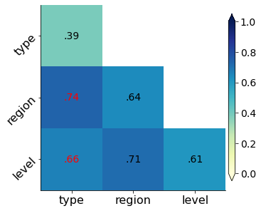

# py-geodetector

A simple and efficient Python package for the **Geographical Detector** (GeoDetector).

## Features

- **Four Detectors**: Factor, Interaction, Risk, and Ecological detectors.
- **High Performance**: Vectorized calculations using Pandas and NumPy for large-scale datasets.
- **Flexible API**: Supports both batch processing and interactive exploratory analysis.
- **Auto Detection**: Automatically identifies discrete/categorical variables as factors.
- **Visualization**: Built-in heatmap for interaction results with statistical significance markers.

## Install

```bash
pip install py-geodetector
```

## Usage

### 1. Data Preparation
- **Format**: pandas DataFrame.
- **Y (Dependent Variable)**: Numerical/Continuous.
- **X (Independent Variable)**: **Categorical/Discrete**. If your $X$ is continuous, you must discretize it first (e.g., using `pd.qcut` or Jenks natural breaks).

### 2. Quick Start

```python
from geodetector import load_example_data, GeoDetector

# Load example disease dataset
df = load_example_data()

# Initialize: Automatically detects discrete columns as factors if 'factors' is not provided
gd = GeoDetector(df, y='incidence')
print(f"Detected factors: {gd.factors}")

# 1. Factor Detector
# Batch detection for all factors
factor_df = gd.factor_detector()
# Single factor detection: returns (q_value, p_value)
q, p = gd.factor_detector('type')

# 2. Interaction Detector
# Full matrix calculation
interaction_df = gd.interaction_detector()
# Pairwise detection with relationship description
q_inter, relationship = gd.interaction_detector('type', 'region', relationship=True)

# 3. Ecological Detector
# Determine if the impact of two factors are significantly different
eco_df = gd.ecological_detector()

# 4. Risk Detector
# Compare average Y between sub-groups of a factor
risk_result = gd.risk_detector('type')
print(risk_result['risk']) # Mean values for each stratum

# 5. Visualization
# Plot interaction heatmap (red markers indicate significant ecological difference)
gd.plot(factors=['type', 'region', 'level'])
```

### 3. Visualization Result
The `plot()` method generates a heatmap of the interaction $q$-statistics. Red text indicates that the ecological detector shows a significant difference ($p < 0.05$) between those factors.



## References

```bibtex
@article{wang2010geographical,
  title={Geographical detectors-based health risk assessment and its application in the neural tube defects study of the Heshun Region, China},
  author={Wang, Jin-Feng and Li, Xin-Hu and Christakos, George and Liao, Yi-Lan and Zhang, Tin and Gu, Xue and Zheng, Xiao-Ying},
  journal={International Journal of Geographical Information Science},
  volume={24},
  number={1},
  pages={107-127},
  year={2010},
  publisher={Taylor \& Francis}
}
```
